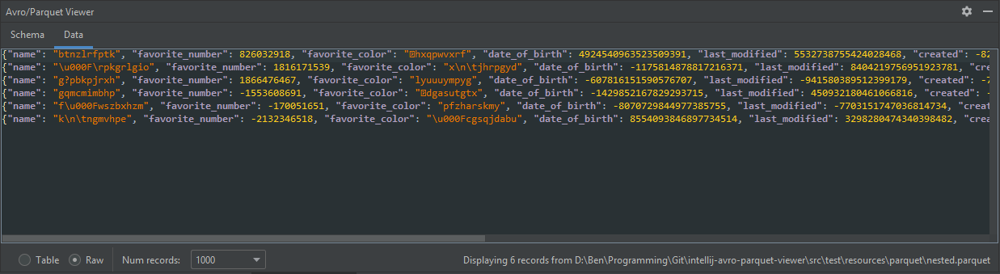

# IntelliJ Avro and Parquet Viewer Plugin

[](https://github.com/benwatson528/intellij-avro-parquet-plugin/actions?query=workflow%3A%22Java+CI%22)
[](https://plugins.jetbrains.com/plugin/12281-avro-and-parquet-viewer)
[](https://lgtm.com/projects/g/benwatson528/intellij-avro-parquet-plugin/alerts/)
[](https://lgtm.com/projects/g/benwatson528/intellij-avro-parquet-plugin/context:java)


## Overview

A Tool Window plugin for IntelliJ that displays Avro and Parquet files and their schemas in JSON.

Features include:
 - Simple drag-and-drop interface
 - Tablulated and JSON viewing of records
 - Column sorting in table view
 - Foldable schema viewing ([RSyntaxTextArea](https://github.com/bobbylight/RSyntaxTextArea))
 - Flattening of nested records in table view ([json-flattener](https://github.com/wnameless/json-flattener))
 - Configurable number of records to display
 - Automatic support for IntelliJ's light and Darcula themes
 - Compatible with all IntelliJ-based products (including PyCharm and Android Studio)


## Installing

Available on the [IntelliJ Plugin Marketplace](https://plugins.jetbrains.com/plugin/12281-avro-and-parquet-viewer). Search "Avro and Parquet Viewer" in IntelliJ's Plugins window. Once installed, it will appear as a Tool Window (normally at the bottom of IntelliJ next to `Run`, `Debug`, `Version Control` etc.).


## Demo


## Gallery

##### Table view:


##### Raw view:



##### Schema view:


## Bug Reports, Feature Requests and Contributions

Raise a [PR](https://github.com/benwatson528/intellij-avro-parquet-plugin/pulls) or [Issue](https://github.com/benwatson528/intellij-avro-parquet-plugin/issues).


## Building Locally

This project can be built locally and manually installed in IntelliJ. To do this:

1. Build the project with `gradlew clean build`.
2. Navigate to `Settings -> Plugins -> Install Plugin From Disk...` and point to the zip in `build/distributions`.


## Release Process

To release a new version of the plugin:

1. Create a `release/x.y.z` branch,
2. Update the `changeNotes` in `build.gradle`,
3. Merge the branch into `master`,
4. Create and push a tag (where `x.y.z` is the current project version) in:
   ```
   git tag -a vx.y.z -m "Create release tag vx.y.z"
   git push origin --tags
   ```
5. When the tag is pushed, the "Create Release" GitHub Action will automatically run and do the following:
   1. Create a Release in GitHub,
   2. Build and upload the plugin zip to both the [GitHub Release](https://github.com/benwatson528/intellij-avro-parquet-plugin/releases) and [GitHub Packages](https://github.com/benwatson528/intellij-avro-parquet-plugin/packages),
   3. Increment the project version and commit the new version to `gradle.properties` and `plugin.xml` in `master`.
6. Upload the zip to the [IntelliJ Marketplace](https://plugins.jetbrains.com/plugin/12281-avro-and-parquet-viewer).


## License

https://www.apache.org/licenses/LICENSE-2.0
