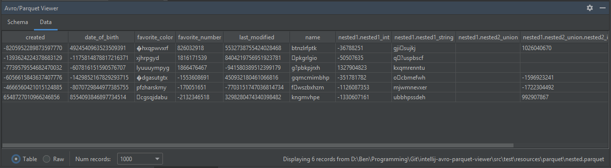

# IntelliJ Avro and Parquet Viewer Plugin

## Overview

A Tool Window plugin for IntelliJ that displays Avro and Parquet files and their schemas in JSON.

Features include:
 - Simple drag-and-drop interface
 - Tablulated and JSON viewing of records
 - Column sorting in table view
 - Foldable schema viewing ([RSyntaxTextArea](https://github.com/bobbylight/RSyntaxTextArea))
 - Flattening of nested records in table view ([json-flattener](https://github.com/wnameless/json-flattener))
 - Configurable number of records to display
 - Automatic support for IntelliJ's light and Darcula themes
 - Compatible with all IntelliJ-based products (including PyCharm and Android Studio)

## Installing

Available on the [IntelliJ Plugin Marketplace](https://plugins.jetbrains.com/plugin/12281-avro-and-parquet-viewer). Search "Avro and Parquet Viewer" in IntelliJ's Plugins window. Once installed, it will appear as a Tool Window (normally at the bottom of IntelliJ next to `Run`, `Debug`, `Version Control` etc.).

## Demo

## Gallery

##### Table view:

##### Raw view:

##### Schema view:

## Bug Reports, Feature Requests and Contributions

Raise a [PR](https://github.com/benwatson528/intellij-avro-parquet-plugin/pulls) or [Issue](https://github.com/benwatson528/intellij-avro-parquet-plugin/issues).

## Building Locally

This project can be built locally and manually installed in IntelliJ. To do this:

1. Build the project with `gradlew clean build`.
2. Navigate to `Settings` -> `Plugins` -> `Install Plugin From Disk...` and point to the zip in `build/distributions`.

## License

https://www.apache.org/licenses/LICENSE-2.0
