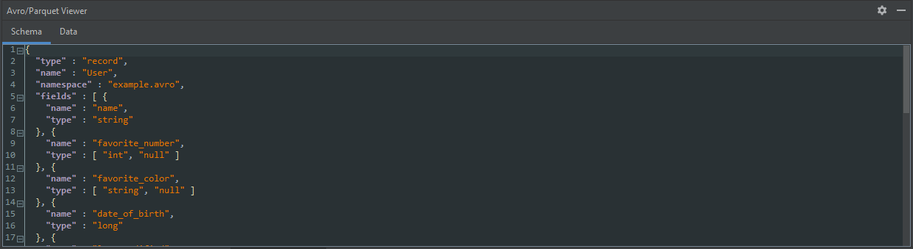

# IntelliJ Avro Plugin

## Overview

A Tool Window plugin for IntelliJ that displays Avro `.avro` files in human-readable JSON format.

Features include:
 - Foldable schema viewing ([RSyntaxTextArea](https://github.com/bobbylight/RSyntaxTextArea))
 - Tablulated or raw viewing of records
 - Column sorting in table view
 - Automatic flattening of nested records in table view ([json-flattener](https://github.com/wnameless/json-flattener))
 - Selectable number of records to show
 - Simple drag-and-drop interface
 - Automatic support for IntelliJ's default and Darcula themes

## Installing
Following https://blog.jetbrains.com/platform/2018/05/legal-news-plugin-license-is-required-for-all-plugins/, it is not
possible for me to upload this plugin to the JetBrains plugin repo. As such installation is manual. 

1. [Download the plugin](https://github.com/benwatson528/intellij-avro-plugin/raw/master/releases/intellij-avro-viewer-1.0.0.zip).
2. In IntelliJ, go to `File -> Settings -> Plugins -> settings cog -> Install Plugin from Disk...` and select the downloaded zip.
3. After a restart, an `Avro Viewer` Tool Window should be visible at the bottom of IntelliJ.

## Images

## Improvements/New Features

Raise a [PR](https://github.com/benwatson528/intellij-avro-plugin/pulls) or [Issue](https://github.com/benwatson528/intellij-avro-plugin/issues).
I'm not planning on implementing it, but it would be trivial to modify this to also deal with Parquet files.